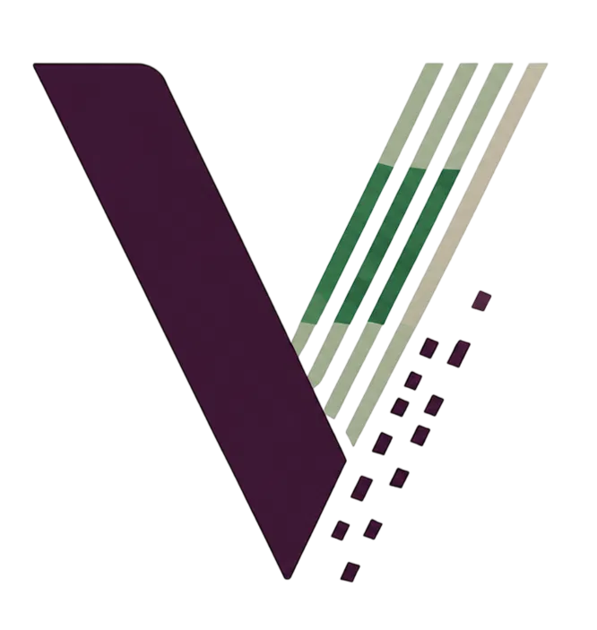

<p align="center">
  
</p>

<h1 align="center">VCARI</h1>

<p align="center">
<b>Verifiable Compliance Assessment for Regulated Industries</b>
</p>

<p align="center">
Privacy-preserving compliance verification powered by Zero-Knowledge Proofs on Stellar.
</p>


[](https://stellar.expert/explorer/testnet/contract/CAY3NMUAZEHW5LL453KL2CCJT5VCOS47C2GXPFV3KAPOUTTVT4XRNST5)
[](https://docs.circom.io/)
[]()
[]()

**[🔍 View Contract on Stellar Expert](https://stellar.expert/explorer/testnet/contract/CAY3NMUAZEHW5LL453KL2CCJT5VCOS47C2GXPFV3KAPOUTTVT4XRNST5)** · **[🎥 Demo Video](#)**

VCARI allows regulated organizations to issue cryptographically verifiable compliance certificates without exposing proprietary operational data. Compliance rules are encoded as a Circom circuit, proven with Groth16, and verified on-chain using Stellar Soroban's native BLS12-381 primitives.

---

## Live Deployment

```
Contract ID: CAY3NMUAZEHW5LL453KL2CCJT5VCOS47C2GXPFV3KAPOUTTVT4XRNST5
Network:     Stellar Testnet
Result:      true ✓
```

Verify directly:

```bash
stellar contract invoke \
  --id CAY3NMUAZEHW5LL453KL2CCJT5VCOS47C2GXPFV3KAPOUTTVT4XRNST5 \
  --network testnet \
  -- verify \
  --proof_bytes "$(cat build/proof.hex)" \
  --pub_signals_bytes "$(cat build/public.hex)"
```

---

## The Problem

A hospital must prove its MRI scanner is calibrated, maintained, and documented — without exposing internal maintenance records, vendor contracts, or operational schedules to auditors or counterparties.

The same problem exists across finance, logistics, energy, manufacturing, and environmental compliance.

---

## Solution

```
                    Private Operational Records
                              │
                              ▼
                 Compliance Assessment Engine
                              │
                              ▼
                   Circom Compliance Circuit
                              │
                              ▼
                     Groth16 Zero-Knowledge Proof
                              │
                              ▼
                 Soroban Smart Contract (Stellar)
                              │
                              ▼
                    Compliance Successfully Verified
```

- Circom compliance circuit (BLS12-381) encodes the rules as arithmetic constraints
- Groth16 proof demonstrates all rules are satisfied without revealing private inputs
- Soroban smart contract verifies the proof on-chain using Stellar's native cryptographic primitives

---

## Quick Start

```bash
git clone https://github.com/licette32/VCARI.git
cd VCARI
./demo.sh
```

Expected output:

```
On-chain verification result: true
Success: Groth16 proof verified on Stellar testnet.
```

Prerequisites:
- Rust + `rustup target add wasm32v1-none`
- Node.js + npm
- Stellar CLI configured with a funded Testnet account
- WSL (for Circom compilation)

---

## Compliance Circuit

4 private inputs, 1 public output.

| Input | Type | Description |
|-------|------|-------------|
| last_calibration_days | private | Days since last calibration |
| max_allowed_days | private | Maximum allowed interval |
| preventive_maintenance | private | 1 if completed |
| documentation_complete | private | 1 if complete |

Output: `compliant = 1` only if all rules are satisfied simultaneously.

---

## Example Applications

| Industry | Example Compliance Rule |
|-----------|-------------------------|
| Biomedical | Equipment calibrated within the allowed interval, preventive maintenance completed, documentation available |
| Finance | Suspicious transaction reported within the regulatory deadline without revealing transaction contents |
| Logistics | Cold-chain temperature remained within limits throughout transportation |
| Energy | Mandatory safety inspection completed by certified personnel before deadline |
| Manufacturing | Production batch passed every required quality control checkpoint |
| Environmental | Emissions remained below regulatory thresholds throughout the reporting period |

---

## Repository Structure

```
circuits/                    Compliance circuit (Circom, BLS12-381)
contract/                    Soroban verifier contract (set_vk, verify)
proving/                     Proving key, witness, sample inputs
frontend/                    React demo UI
tools/circom_to_soroban_hex/ snarkjs JSON → Soroban hex encoder (Rust CLI)
build/                       Generated artifacts (regenerable)
demo.sh                      End-to-end pipeline script
```

---

## Acknowledgements

This project builds on the Soroban Groth16 verifier contract and circom-to-soroban-hex tooling from [CircomStellar](https://github.com/jamesbachini/CircomStellar) by James Bachini.

The compliance circuit, regulatory use case, application domain, and frontend were developed for VCARI.

---

## Disclaimer

VCARI is an experimental prototype developed for the Stellar Real-World ZK Hackathon.

The project demonstrates privacy-preserving compliance verification using ZK Proofs on Stellar and has not undergone a security audit

---

## License

MIT
